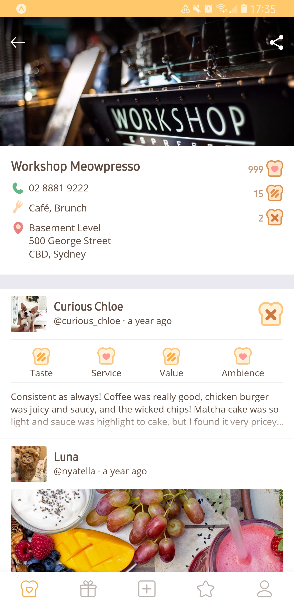

# ☄️ Final Frontier 1.0.0

✨ React Native Expo App powered by Redux consuming the [Toaster](https://github.com/psyanite/toaster/)

🔥 Check it out now on [Expo](https://expo.io/@psyanite/burntoast) or [the simulator](https://expo.io/appetize-simulator?url=https://expo.io/@psyanite/burntoast)!

&nbsp;&nbsp;&nbsp;

&nbsp;&nbsp;&nbsp;

### Development Tools

* IntelliJ
* Git
* Git Bash
* Git Kraken
* Expo
* Genymotion

### How to reach the final frontier

* Start up the frakkin toaster
* [Setup Genymotion with Expo](https://medium.com/@psyanite/how-to-use-genymotion-with-expo-cc52815928cf)
* Or install Expo on a device
* Update the host in `config/index.js`
* Start project on Expo XDE
* In Expo XDE, change Host to LAN, and enable Development Mode
